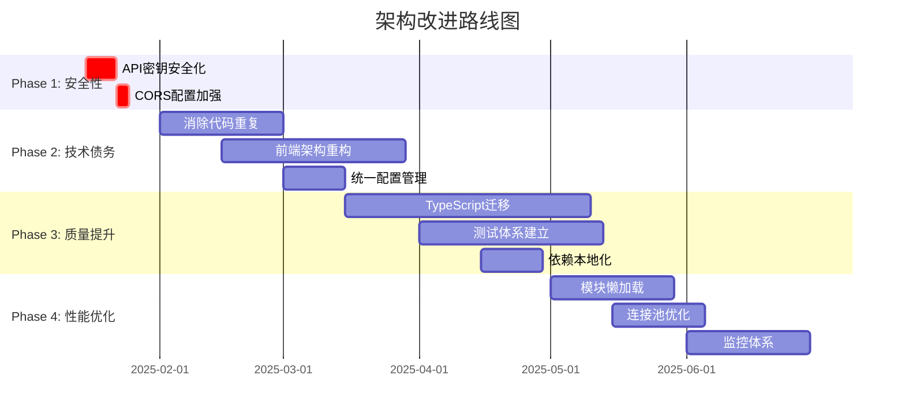

# Gemini Playground - 架构审查报告

## 执行摘要

`gemini-playground` 项目是一个功能丰富的 Gemini AI 交互界面，支持多媒体实时通信和工具集成。项目展现了良好的模块化思想和事件驱动架构，但存在关键的安全漏洞和技术债务，需要立即处理以确保项目的长期可维护性和安全性。

**关键发现：**
- ✅ **优势**：模块化设计、工具扩展性、错误处理体系完善
- ⚠️ **关键问题**：API密钥安全风险、代码严重重复、单体前端架构
- 🎯 **改进潜力**：通过架构重构可显著提升开发效率和安全性

## 项目架构概览

### 技术栈
- **前端**: 原生 JavaScript + ES6 模块 + Web APIs
- **后端**: 双运行时支持 (Cloudflare Workers + Deno)
- **通信**: WebSocket + HTTP 代理
- **部署**: Cloudflare Workers / Deno 服务器

### 架构模式
1. **代理模式** - WebSocket 和 API 代理分离处理
2. **观察者模式** - EventEmitter 驱动的 WebSocket 客户端
3. **插件架构** - 可扩展的工具管理系统
4. **多运行时策略** - 支持多部署环境（存在问题）

## 关键问题分析（按严重程度排序）

### 🚨 **CRITICAL - 立即处理**

#### 1. API密钥安全漏洞
**位置**: `src/static/js/main.js:252`, `src/static/js/core/websocket-client.js:67`
```javascript
// 问题代码
localStorage.setItem('gemini_api_key', apiKeyInput.value);
const ws = new WebSocket(`${this.baseUrl}?key=${apiKey}`);
```
**风险**: 
- API密钥完全暴露给客户端，可通过浏览器开发工具访问
- 存在 XSS 攻击风险，可能导致 API 滥用和费用损失

**解决方案**: 实现安全的后端代理，API密钥仅存储在服务端环境变量中

### 🔥 **HIGH - 1-2周内处理**

#### 2. 严重的代码重复问题
**位置**: `src/index.js` vs `src/deno_index.ts`
**问题**: WebSocket 处理逻辑重复度 >90%，违反 DRY 原则
```javascript
// index.js (lines 61-178) 与 deno_index.ts (lines 16-67) 几乎相同
async function handleWebSocket(request, env) { /* 重复逻辑 */ }
```
**影响**: 
- 维护成本高：每个功能需要修改两次
- 容易引入不一致性
- 增加技术债务

**解决方案**: 创建共享的 WebSocket 处理模块或选择单一运行时

#### 3. 单体前端架构
**位置**: `src/static/js/main.js` (558行)
**问题**: UI控制、状态管理、业务逻辑全部混合在一个文件中
```javascript
// 混合了所有关注点
let isRecording = false;
let audioStreamer = null;
let isConnected = false;
// ... 全局状态管理
```
**影响**:
- 难以测试和维护
- 功能扩展困难
- 新开发者上手困难

**解决方案**: 模块化重构，分离 UI、状态管理和业务逻辑

### ⚠️ **MEDIUM - 1-2个月内处理**

#### 4. CORS 安全配置不当
**位置**: `src/api_proxy/worker.mjs:57`
```javascript
headers.set("Access-Control-Allow-Origin", "*");
```
**解决方案**: 限制为特定域名，移除通配符

#### 5. 测试覆盖不足
**现状**: 仅有基础 worker 测试，缺乏前端和集成测试
**影响**: 回归风险高，重构困难
**解决方案**: 建立完整的测试金字塔（单元测试、集成测试、E2E测试）

#### 6. 供应链安全风险
**位置**: `src/static/js/core/websocket-client.js:1`
```javascript
import { EventEmitter } from 'https://cdn.skypack.dev/eventemitter3';
```
**风险**: CDN 依赖可能不可用或被恶意修改
**解决方案**: 本地化依赖或使用 npm/bundler

### 🔧 **LOW - 长期改进**

#### 7. 缺乏类型安全
**问题**: 前端 JavaScript 缺乏类型检查
**解决方案**: 迁移到 TypeScript 或添加 JSDoc 类型注释

## 战略改进建议

### Phase 1: 安全性加固 (立即实施)
**时间**: 1-2周
**优先级**: P0

1. **API密钥安全化**
   - 创建后端 API 密钥管理服务
   - 移除客户端存储的敏感信息
   - 实施服务端代理模式

2. **CORS 配置加强**
   - 限制允许的域名
   - 实施更严格的访问控制

### Phase 2: 技术债务清理 (1-2个月)
**时间**: 4-8周
**优先级**: P1

1. **消除代码重复**
   ```
   选项A: 选择单一运行时 (推荐 Cloudflare Workers)
   选项B: 创建共享核心模块
   ```

2. **前端架构重构**
   ```
   main.js (558行) → 分解为:
   ├── controllers/
   │   ├── AudioController.js
   │   ├── VideoController.js
   │   ├── ConnectionController.js
   │   └── UIController.js
   ├── services/
   │   ├── WebSocketService.js
   │   └── ConfigService.js
   └── utils/
       └── StateManager.js
   ```

3. **统一配置管理**
   - 环境感知的配置中心
   - 分离用户偏好和应用配置

### Phase 3: 质量提升 (2-3个月)
**时间**: 8-12周
**优先级**: P2

1. **TypeScript 迁移**
   - 渐进式迁移策略
   - 关键模块优先

2. **测试体系建立**
   ```
   测试金字塔:
   ├── 单元测试 (Jest/Vitest)
   ├── 集成测试 (API + WebSocket)
   └── E2E测试 (Playwright)
   ```

3. **依赖本地化**
   - 使用 bundler (Webpack/Vite)
   - 供应链安全检查

### Phase 4: 性能优化 (3-6个月)
**时间**: 12-24周
**优先级**: P3

1. **模块懒加载**
   - 动态 import
   - 代码分割优化

2. **连接池优化**
   - WebSocket 连接重用
   - 健康检查机制

3. **监控体系**
   - 错误追踪 (Sentry)
   - 性能监控 (Web Vitals)

## 快速胜利 (Quick Wins)

可立即实施的低成本、高收益改进：

1. **集中前端配置** - 统一 `config.js` 管理所有配置
2. **改进错误日志** - 集成错误追踪服务
3. **后端输入验证** - 添加基础请求验证
4. **标准化工具声明** - 重构 `ToolManager.getToolDeclarations()` 逻辑

## 实施路线图



## 投资回报分析

| 改进项目 | 实施成本 | 预期收益 | ROI |
|---------|---------|---------|-----|
| API密钥安全化 | 中 | 极高 | 极高 |
| 消除代码重复 | 高 | 高 | 高 |
| 前端重构 | 高 | 高 | 高 |
| 测试体系 | 中 | 中 | 中 |
| TypeScript迁移 | 中 | 中 | 中 |

## 结论

项目具有坚实的基础架构和良好的模块化思想，主要问题集中在安全性和技术债务层面。通过系统性的分阶段改进，可以将项目转变为高质量、可维护的现代化应用。

**立即行动项目**：
1. 🚨 修复 API 密钥安全漏洞
2. 🔥 解决代码重复问题  
3. ⚠️ 重构单体前端架构

**长期目标**：
- 建立现代化的开发工作流
- 实现完全的类型安全
- 构建全面的监控体系

---
*报告生成时间: 2025-01-11*  
*分析工具: Zen Architecture Analysis with Flash + Pro Thinking Mode*